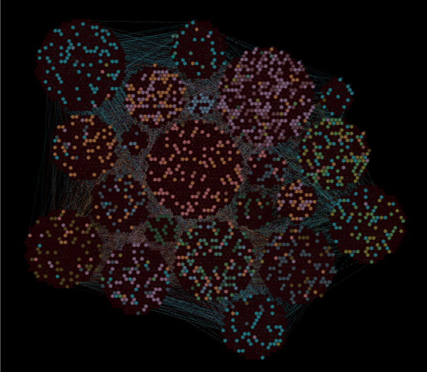

## Analiza sieci cytowań pracowników PWr

[Pogrupowana sieć](https://frugile.github.io/onos-pwr/cite/network/)

[Kliki w sieci](https://frugile.github.io/onos-pwr/cite/network-clique/)

[Podgrupowanie wg. modularity class a wydziały](https://frugile.github.io/onos-pwr/cite/network-deps/)

---

*wykonano przez: Filip Dratwiński, Karol Gawron, Piotr Gramacki, Maksym Telepchuk*

*w ramach projektu zespołowego na kursie Obliczeniowa Nauka o Sieciach*
